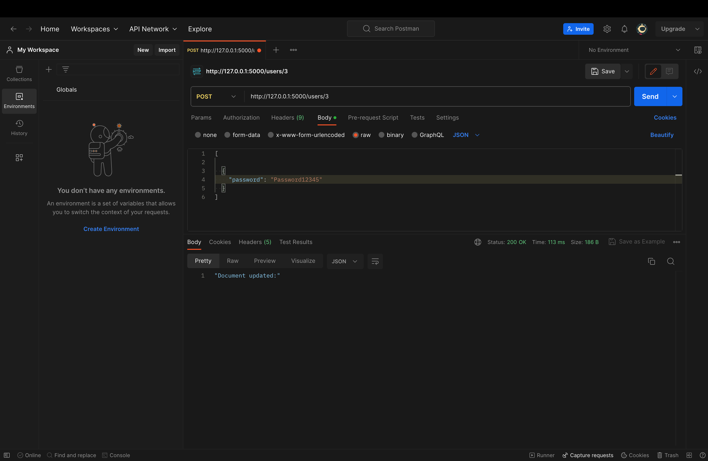
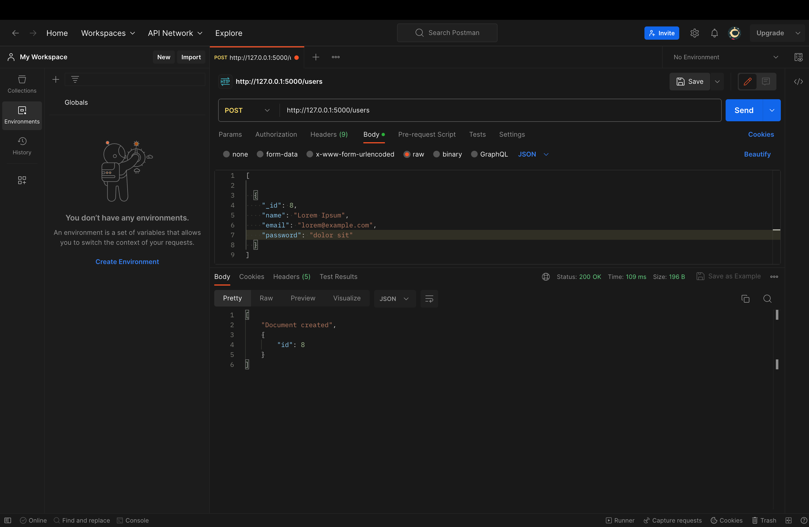
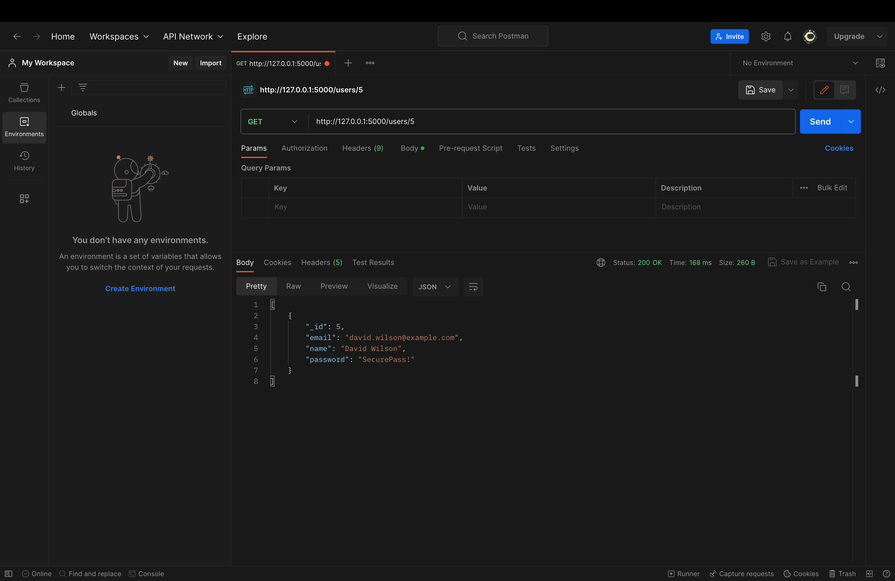
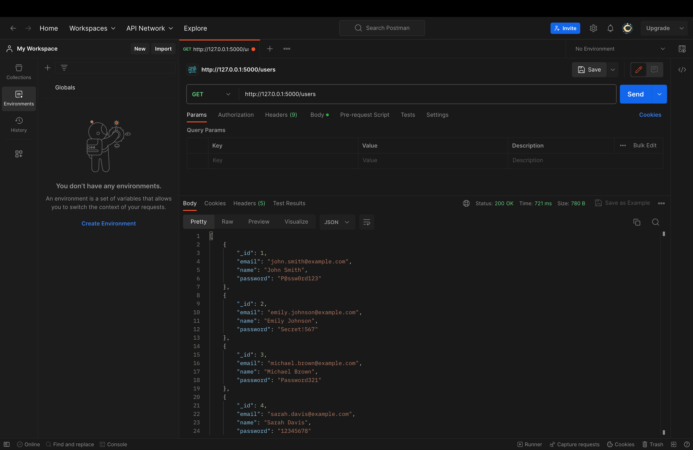

# Assignment: Flask Application for CRUD operations on MongoDB

A Flask application that performs CRUD (Create, Read, Update, Delete) operations on a MongoDB database for a User resource using a REST API.
## Installation

Clone my-project with git

```bash
git clone https://github.com/fizzzemdegs/CoRider-RESTful-API.git
```
Run via docker 
```bash
docker pull fardinhossain/corider-task:0.0.1.RELEASE
docker container run -d -p <portnumber>:5000 fardinhossain/corider-task:0.0.1.RELEASE
```

## Postman API Testing







## License

[MIT](https://choosealicense.com/licenses/mit/)


## Authors

- [@fizzzemdegs](https://github.com/fizzzemdegs)


